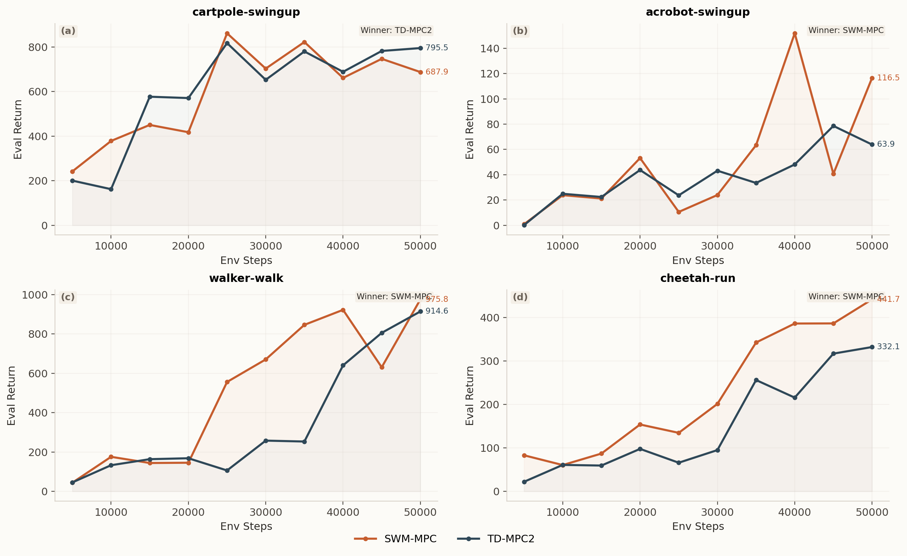

# 新疆大学本科毕业论文（设计）Markdown 示例

## 封面信息

论文题目：新疆大学本科毕业论文 Markdown 转 Word 模板示例

学生姓名：张三

学号：20220801234

所属院系：数学与系统科学学院

专业：数学与应用数学

班级：应数22-1班

指导教师：李四

日期：2026 年 4 月

---

## 声明

本人郑重声明：本示例文档仅用于演示新疆大学本科毕业论文 Markdown 到 Word 的导出流程，不作为真实论文提交材料。

作者签名：__________

签字日期：__________

---

## 摘要

本文围绕新疆大学本科毕业论文写作场景，给出一个基于 Markdown 主稿与 Word 模板导出的示例工作流。该流程以结构化文本作为长期维护载体，通过模板继承、公式转换、图表插入、目录生成和参考文献链接等机制，形成一条适合多轮修改与反复导出的论文排版路径。为便于使用者快速上手，本文示例进一步展示了标题层级、单图、并排图、表格、行内公式、块公式、参考文献和附录等常见论文元素在该工具中的写法。

从示例内容可以看出，将论文主稿维护在 Markdown 中，有助于把“内容修改”与“提交格式”分离：前者主要关注章节组织、论证与实验结果；后者则集中在模板继承、目录刷新、分页检查和最终审阅。对于需要反复修改的毕业论文而言，这种方式可以显著减少重复排版劳动，并提高文稿版本管理效率。

关键词：Markdown；Word；毕业论文；模板；自动化

---

## ABSTRACT

This document presents a Markdown-to-Word workflow for Xinjiang University undergraduate theses. The core idea is to keep the thesis source in Markdown, inherit formatting and section settings from a DOCX template, and generate a reviewable Word document with a cover page, table of contents, figures, tables, references, and appendices. To make the workflow easier to understand, this sample thesis explicitly demonstrates heading hierarchies, single figures, side-by-side figures, tables, inline equations, display equations, references, and appendices.

The example also highlights a practical separation of concerns. Markdown is used to maintain the evolving academic content, while Word is reserved for final formatting inspection, advisor review, and submission-oriented polishing. For undergraduate theses that often require repeated revisions, this separation can reduce redundant typesetting work and improve document version management.

KEY WORDS: Markdown; Word; Thesis; Template; Automation

---

## 目录

1 绪论

2 Markdown 论文写作表达示例

3 导出器设计与实现示例

4 结果展示与版式分析

5 结论

参考文献

致谢

附录

---

# 1 绪论

## 1.1 研究背景

毕业论文在撰写后期通常会经历多轮结构性修改。若全文直接维护在 Word 中，章节调整、目录刷新、图表移动、批量替换和版本对比会逐步变得低效。将主稿长期维护在 Markdown 中，则更适合配合版本控制、文本差异比较和结构性重写[1-2]。

对于一套论文导出工具而言，目标并不是完全取代 Word，而是在“内容维护”与“最终提交格式”之间建立清晰分工。若以“文稿维护成本”作为抽象目标，则其优化方向可以写成：

$$
\min_{\mathcal{W}} \ \mathcal{L}_{draft} + \lambda \mathcal{L}_{format},
$$

其中，$\mathcal{L}_{draft}$ 表示正文修改和版本维护成本，$\mathcal{L}_{format}$ 表示格式调整与交叉检查成本，$\lambda$ 为两类成本之间的权衡系数。对于大多数本科论文而言，希望降低的并不是“最终人工检查”本身，而是前期和中期反复排版带来的重复劳动。

## 1.2 研究目标与评价视角

本示例并不研究新的自然语言处理算法，而是围绕毕业论文工作流本身给出一个可复用的写作与导出方案。其目标主要有三个方面。

第一，保证论文主稿能够以结构化文本的方式持续维护。第二，保证生成的 Word 文档尽量继承学校模板中的节属性、页眉页脚和样式。第三，保证图片、表格、目录和参考文献等常见元素能够在一次导出后形成可继续人工验收的中间结果[3-4]。

为说明这个流程的评价角度，本文采用三个简单指标：

表 1-1 示例评价指标

| 指标 | 含义 | 观察方式 |
| --- | --- | --- |
| 内容维护效率 | 是否便于重写和批量修改 | 比较 Markdown 与直接改 Word 的修改过程 |
| 版式继承能力 | 是否尽量保持学校模板样式 | 观察导出后目录、段落和页码区域 |
| 最终可交付性 | 是否便于导师审阅和提交前检查 | 打开 Word / WPS 进行人工验收 |

## 1.3 本文结构安排

本文余下内容安排如下。第二章重点展示 Markdown 在论文场景下的表达方式，包括公式、表格、单图和并排图。第三章给出导出器的逻辑结构与工作流设计。第四章展示示例结果，并从图表排版与引用效果角度分析导出结果。第五章给出结论与使用建议。

# 2 Markdown 论文写作表达示例

## 2.1 行内公式与块公式

在论文正文中，行内公式适合表达紧凑的概念，例如目标函数 $J(\theta)$、折扣因子 $\gamma$ 或状态变量 $z_t$。当公式较长时，宜使用块公式以提高可读性。以强化学习中的 Bellman 递推为例，可写为：

$$
Q^\pi(s_t,a_t)=r_t+\gamma\mathbb{E}_{s_{t+1},a_{t+1}\sim\pi}\left[Q^\pi(s_{t+1},a_{t+1})\right].
$$

若进一步定义一条长度为 $T$ 的评估曲线 $\{y_t\}_{t=1}^T$，则其归一化面积可写为：

$$
\operatorname{AUC}=\frac{1}{T}\sum_{t=1}^{T} y_t.
$$

这些公式在导出时若成功转换为 Word 原生公式，会比直接保留 LaTeX 字符串更适合审阅与打印。

## 2.2 表格表达示例

除公式外，表格也是本科论文中非常高频的元素。下表给出本工具支持的常见论文元素：

表 2-1 工具支持的常见论文元素

| 能力 | 示例 | 说明 |
| --- | --- | --- |
| 一级到三级标题 | `#` / `##` / `###` | 控制目录层级 |
| 单图 | `` | 图与图题分开写更稳 |
| 并排图 | `:::figure-row` | 适合两图横向对比 |
| 行内公式 | `$J(\theta)$` | 适合短公式 |
| 块公式 | `$$ ... $$` | 适合长公式 |
| 参考文献 | `[1]` | 可生成正文到文末的跳转 |

再例如，若需要汇总不同写作方式的优缺点，也可使用更偏“分析表”的写法：

表 2-2 常见写作载体对比

| 写作载体 | 优点 | 局限 |
| --- | --- | --- |
| 纯 Word | 上手直接、编辑所见即所得 | 多轮结构性修改成本较高 |
| 纯 Markdown | 适合版本管理与批量修改 | 最终提交格式需额外处理 |
| Markdown + 模板导出 | 兼顾结构维护与最终交付 | 仍需最终人工验收 |

## 2.3 单图写法

单图适合展示一个独立结果或总览图。下面给出一个单图示例。

图 2-1 最终回报与 step-AUC 汇总示例

图 2-1 更适合用来展示最终回报或聚合指标，因为单张图不会分散读者注意力，适合在章节中作为核心结果图进行说明。

## 2.4 并排图写法

如果需要强调两种结果之间的对比关系，则并排图更合适。下面展示一组并排图。

:::figure-row

:::

图 2-2 并排图写法示例

并排图有两个好处。第一，可以把“结果汇总图”和“过程曲线图”放在同一视觉区域内，便于横向比较。第二，当两幅图高度统一时，整体版式更规整，适合论文正文中的方法对比或实验分析场景。

## 2.5 行内引用与交叉说明

在论文正文中，公式和引用往往会同时出现。例如，当讨论“世界模型”方法的样本效率时，可以同时引用 DreamerV3 和相关的 Markdown 语法说明文档[1-2]。若进一步涉及模型预测控制、文档格式继承和 OOXML 结构，也可以继续引用更偏工程实践的资料[3-6]。

这一点说明：对于论文示例而言，最重要的不是“引用数量很多”，而是引用在结构上保持统一，并能在导出后形成可点击的文末跳转。

# 3 导出器设计与实现示例

## 3.1 总体流程

本工具的导出流程可以简要概括为“解析主稿、加载模板、处理资源、生成文档”四步：

$$
\text{Markdown Source} \rightarrow \text{Parser} \rightarrow \text{Template Merge} \rightarrow \text{DOCX Output}.
$$

其中，解析器首先识别封面信息、摘要、目录和正文标题；随后导出器继承模板的节属性与样式；最后再将图片、表格、公式和参考文献信息写入新的 Word 文档结构中。

## 3.2 文档结构解析

从实现角度看，主稿并不是任意 Markdown，而是一个适合毕业论文写作的受控子集。正文必须从编号一级标题开始，前置部分则按 `封面信息`、`声明`、`摘要`、`ABSTRACT`、`目录` 等部分组织。这样做的好处在于，导出器能够稳定地区分“封面前言部分”和“正文部分”，并在生成 Word 文档时插入不同的节和分页。

如果记主稿文本为 $\mathcal{D}$，前置部分集合为 $\mathcal{F}$，正文部分为 $\mathcal{B}$，则可以把解析过程写成：

$$
\mathcal{D}\mapsto (\mathcal{F}, \mathcal{B}).
$$

这种抽象虽然简单，却足以支撑大多数本科论文场景。

## 3.3 图表与公式资源处理

图表和公式是最容易在导出链路中出问题的两类元素。图片需要同时处理路径、尺寸和版式；公式则需要在“尽量转换成 Word 原生公式”和“依赖缺失时保底导出”之间取得平衡。

当前实现中，并排图使用固定宽度表格承载，再对图片进行统一高度或统一约束范围的缩放，以保证整体观感整齐。公式部分则在依赖齐全时把 LaTeX 转成 OMML，依赖缺失时退化成原始文本并打印 warning，而不会阻塞整篇论文导出。

## 3.4 最终验收原则

即使使用自动化导出，最终仍然建议在 Word 或 WPS 中检查目录、图号、表号、分页和参考文献格式。这一步不应该被自动化省略。自动化导出的价值，在于把反复修改阶段的重复劳动尽量前移并削减，而不是取消最后的提交格式验收。

# 4 结果展示与版式分析

## 4.1 结果总览图

为了展示单图在正文中的效果，下面给出一个更偏“总览”的结果图示例。

图 4-1 评估曲线总览示例

在真实论文中，这类图通常用于展示不同方法随训练步数变化的评估趋势。与最终柱状图相比，曲线总览图更适合讨论训练过程、收敛速度和阶段性波动。

## 4.2 结果表格与描述

若把图 2-1 和图 4-1 的用途放在同一个分析框架里，则可以得到如下结果组织方式：

表 4-1 结果展示方式的适用场景

| 展示方式 | 更适合回答的问题 | 推荐放置位置 |
| --- | --- | --- |
| 最终柱状图 | 哪个方法最终更好 | 结果章节开头或总结处 |
| 曲线总览图 | 哪个方法收敛更稳、更快 | 结果分析正文 |
| 并排图 | 汇总结果与过程结果如何对应 | 需要对比说明的段落 |

由此可见，图与表并不是互相替代关系，而是相互补充。图更偏向直观展示，表则更适合对比和总结。在本科论文场景中，二者往往需要同时存在。

## 4.3 版式观感分析

从导出结果看，若单图、并排图、表格和公式都遵循统一的写法规则，则最终 Word 文档在观感上会更加稳定。尤其是并排图，若左右图片高度一致，读者会更容易把它们理解为同一组结果；若参考文献引用可以直接跳转，则审阅过程也会更顺畅。

因此，一个好的论文导出示例，不只是“能生成文档”，还应该尽量展示真实论文里最常见、最容易出问题的排版元素。

# 5 结论

本文示例说明，将新疆大学本科毕业论文长期维护在 Markdown 中，再导出到 Word，是一种适合反复修改和多轮审阅的实用工作流。对多数同学而言，它最大的价值不是“零人工排版”，而是“减少重复劳动，并把人工精力集中在最后一次格式验收上”。

进一步说，这套示例不仅展示了标题、目录、图片、表格和参考文献的基本导出能力，也刻意展示了块公式、并排图和引用跳转等更接近真实论文写作的场景。因此，它更适合作为“模板示例论文”，而不是一份最小化的语法演示文档。

---

# 参考文献

[1] Hafner D, Pasukonis J, Ba J, et al. Mastering diverse domains through world models[EB/OL]. arXiv:2301.04104, 2023.

[2] Gruber J. Markdown: syntax documentation[EB/OL]. Daring Fireball, 2004.

[3] Hansen N, Wang X, Su H, et al. Temporal difference learning for model predictive control[C]//Proceedings of the 39th International Conference on Machine Learning. 2022.

[4] Pandoc User’s Guide[EB/OL]. https://pandoc.org, 2026.

[5] ECMA-376 Office Open XML File Formats[EB/OL]. Ecma International, 2021.

[6] Microsoft. Office Open XML structure overview[EB/OL]. Microsoft Learn, 2026.

---

# 致谢

感谢所有为毕业论文写作流程提供模板、规范和建议的老师与同学。本示例仓库只服务于模板导出流程演示，也希望它能为后续使用 Markdown 维护论文主稿的同学提供一个更清晰的起点。

---

# 附录

## 附录 A 常用写法速查

| 写法 | 示例 |
| --- | --- |
| 一级标题 | `# 1 绪论` |
| 二级标题 | `## 1.1 背景` |
| 单图 | `` |
| 并排图 | `:::figure-row` |
| 引文 | `[1]` |
| 块公式 | `$$ ... $$` |
